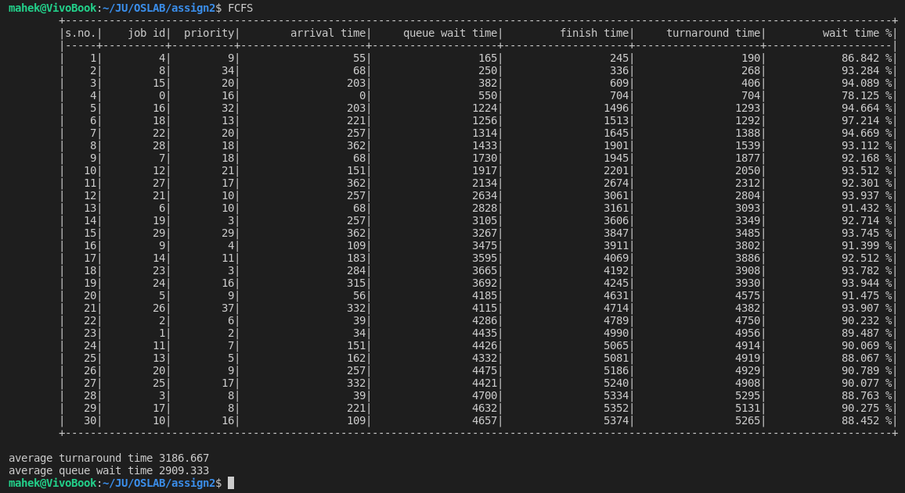
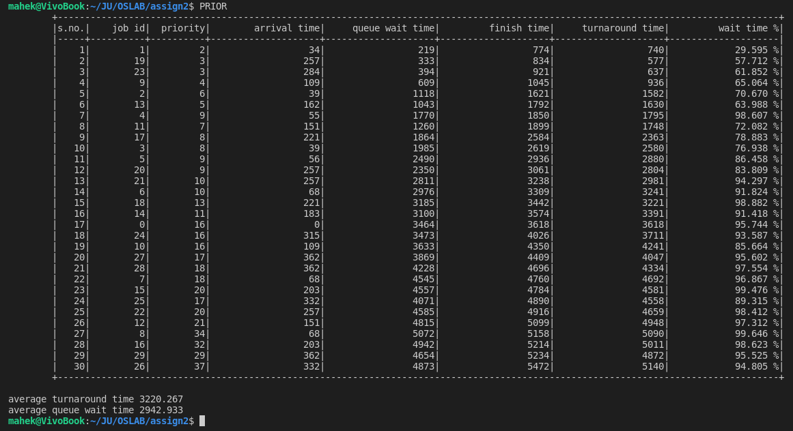
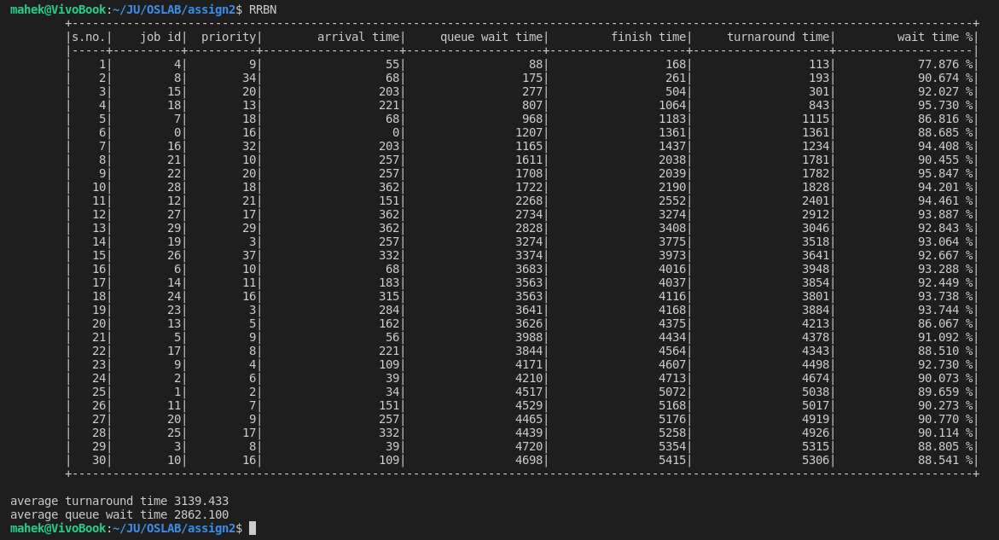
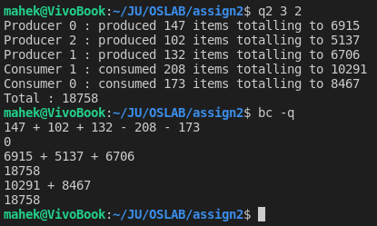
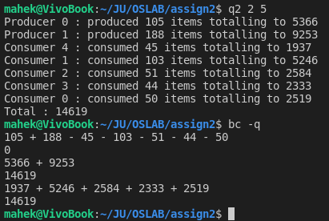
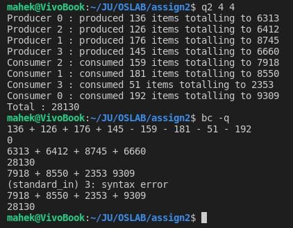
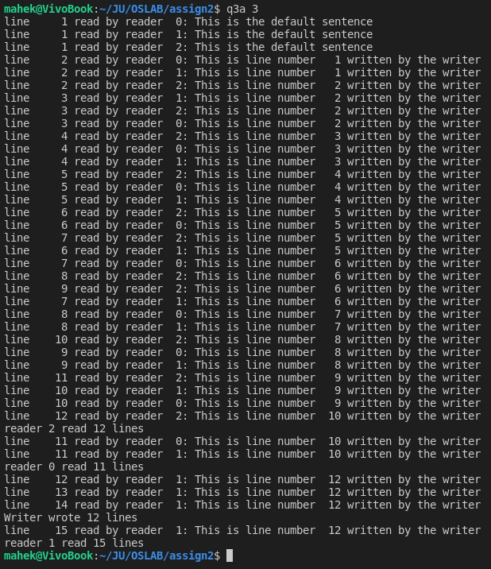
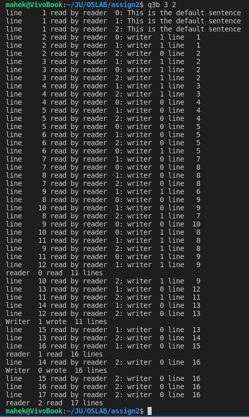
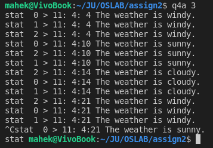
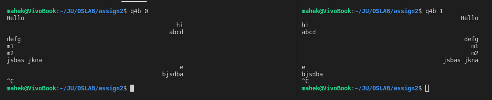

<link rel="stylesheet" href=".vscode/mdcss.css"></link>

# Operating Systems Lab

<div id="info">

**Assignment II**\
**Mahek Shamsukha | BCSE III**\
Roll **001910501081**\
[mshamsukha@gmail.com](mailto:mshamsukha@gmail.com?subject=OSLAB%20Assignment%202 "e-Mail")

</div>
---

## Question 1
### Statement
Design a CPU scheduler for jobs whose execution profiles will be in a file that is to be read and appropriate scheduling algorithm to be chosen by the scheduler.

Format of the profile:

>`<Job id> <priority> <arrival time> <CPU burst(1) I/O burst(1) CPU burst(2) ....... > -1`

(Each information is separated by blank space and each job profile ends with -1. Lesser priority number denotes higher priority process with priority number 1 being the process with highest priority.)

Example: 2 3 4 100 2 200 3 25 -1 7 1 8 60 10 ..... -1 etc.

Testing:

1. Create job profiles for 30 jobs and use three different scheduling  algorithms (FCFS, Priority and Round Robin (time slice: 25)).
1. Compare the average waiting time, turnaround time of each process for the different scheduling algorithms.
   
---
### Solution


```
q1.h
 L_________________________________
 |               |                 L FCFS.c -- FCFS.o 
 q1.c            q1-common.c       L PRIOR.c -- PRIOR.o
 |               |                 L RRBN.c -- RRBN.o
 q1-main.o       q1-common.o                     
 L_______________|                     
     |
  q1-skeleton.o
  
q1-skeleton.o + FCFS.o = FCFS
q1-skeleton.o + PRIOR.o = PRIOR
q1-skeleton.o + RRBN.o  = RRBN
```

**q1.h**
```c
#include <stdio.h>
#include <stdlib.h>
#include <limits.h>
#define __MAX_MASK__ 127
#ifndef Q1_H
#define Q1_H
struct burststruct
{
	int time;
	struct burststruct *next;
};
typedef struct jobstruct
{
	int jobid, priority, arrival;
	struct burststruct *bursts;
} job;

struct jobnode
{
	job j;
	struct jobnode *next;
};

typedef struct jbqstr
{
	struct jobnode *head, *tail;
} job_queue;

typedef enum
{
	new_job,
	cpuend,
	ioend,
	done
} event;

struct stat
{
	int jobid, arrival, finish, wait, priority;
};
#endif

extern int time;
extern int cpu, io;
extern job_queue unarrived, jobqueue, ioqueue;
extern int currentjobs[__MAX_MASK__][4];
extern int cpubusy, iobusy;
extern job currentcpujob, currentiojob;
extern int count;
extern struct stat stats[1000];
extern job dummy;

extern void process_cpu_end();
extern void put_in_cpu();
extern void put_in_io();
extern void remove_waiting();
extern void accept_new_jobs();
extern void get_next_event(event *);

/* basic queue operations */
#pragma region queue_operations

extern void init_q(job_queue *q);

extern void push(job_queue *q, job j);

extern int empty(job_queue q);

extern job front(job_queue q);

extern void pop(job_queue *q);
#pragma endregion

/* parses jobs from a file called "jobs" */
extern int parse_jobs();

/* store stats regarding a completed job with job_id id */
extern void store_stats(int id);

/* displays results */
extern void display_results();

```

**q1.c**
```c
#include "q1.h"
int time = 0;
int cpu = 0, io = 0;
job_queue unarrived, jobqueue, ioqueue;
int currentjobs[__MAX_MASK__][4] = {0};
int cpubusy = 0, iobusy = 0;
job currentcpujob, currentiojob;
int count = 0;
struct stat stats[1000];
job dummy = {-1, -1, -1, NULL};
int main()
{
	init_q(&unarrived);
	init_q(&ioqueue);
	init_q(&jobqueue);
	event currentevent = new_job;
	if (parse_jobs())
	{
		return 1;
	}
	if (empty(unarrived))
		goto DONE;
#define GO_TO_NEXT_EVENT           \
	get_next_event(&currentevent); \
	switch (currentevent)          \
	{                              \
	case new_job:                  \
		goto NEWJOB;               \
	case cpuend:                   \
		goto CPUEND;               \
	case ioend:                    \
		goto IOEND;                \
	case done:                     \
		goto DONE;                 \
	}
	GO_TO_NEXT_EVENT
NEWJOB:
	accept_new_jobs();
	GO_TO_NEXT_EVENT
CPUEND:
	process_cpu_end();
	GO_TO_NEXT_EVENT
IOEND:
	remove_waiting();
	GO_TO_NEXT_EVENT
DONE:
	display_results();
#undef GO_TO_NEXT_EVENT
}
```

**q1-common.c**
```c
#include "q1.h"

/* basic queue operations */
#pragma region queue_operations

extern job dummy;
extern int count;
void init_q(job_queue *q)
{
	q->head = q->tail = NULL;
}

void push(job_queue *q, job j)
{
	if (q->head)
		q->tail = q->tail->next = (struct jobnode *)malloc(sizeof(struct jobnode));
	else
		q->tail = q->head = (struct jobnode *)malloc(sizeof(struct jobnode));
	q->tail->j = j;
}

int empty(job_queue q)
{
	return !q.head;
}

job front(job_queue q)
{
	if (q.head)
		return q.head->j;
	else
		return dummy;
}

void pop(job_queue *q)
{
	if (q->head)
	{
		if (q->head == q->tail)
		{
			free(q->head);
			q->head = q->tail = NULL;
		}
		else
		{
			struct jobnode *t = q->head;
			q->head = q->head->next;
			free(t);
		}
	}
}

#pragma endregion

/* parses jobs from a file called "jobs" */
int parse_jobs()
{
	/*
	 * Assumption: job descriptions are given in primarily non-decreasing order of time and secondarily non-decreasing order of priority number
	 */
	FILE *f = fopen("jobs", "r");
	if (f == NULL)
	{
		perror("Could not open file\n");
		return 1;
	}
	int l = 0;
	while (1)
	{
		l++;
		int id, pr, atime;
		if (fscanf(f, "%d", &id) == EOF)
			break;
		fscanf(f, "%d", &pr);
		fscanf(f, "%d", &atime);
		id &= __MAX_MASK__;
		job j;
		j.jobid = id;
		j.priority = pr;
		j.arrival = atime;
		struct burststruct h, *cur;
		h.next = NULL;
		cur = &h;
		int fl = 1;
		while (1)
		{
			int t;
			fscanf(f, "%d", &t);
			if (t == -1)
				break;
			cur = cur->next = (struct burststruct *)malloc(sizeof(struct burststruct));
			cur->time = t;
			fl = !fl;
		}
		if (!h.next)
		{
			printf("job at line %d ends with has no bursts. Ingoring it.\n", l);
			continue;
		}
		if (fl)
		{
			printf("job at line %d ends with an IO burst. Ingoring it.\n", l);
			continue;
		}
		j.bursts = h.next;
		push(&unarrived, j);
	}
	return 0;
}

/* store stats regarding a completed job with job_id id */
void store_stats(int id)
{
	struct stat *s = stats + count++;
	s->jobid = id;
	s->arrival = currentjobs[id][1];
	s->finish = time;
	s->wait = time - s->arrival - currentjobs[id][2];
	s->priority = currentjobs[id][3];
	currentjobs[id][0] = 0;
}

/* displays results */
void display_results()
{
	if (count == 0)
	{
		printf("No Results to display!\n");
		return;
	}
	int i;
#define REPEAT(n, ch) \
	i = n;            \
	while (i--)       \
		printf("%c", ch);
	REPEAT(1, '\t')
	REPEAT(1, '+')
	REPEAT(132, '-')
	REPEAT(1, '+')
	REPEAT(1, '\n')
	printf("\t|%5s|%10s|%10s|%20s|%20s|%20s|%20s|%20s|\n", "s.no.", "job id","priority", "arrival time", "queue wait time", "finish time", "turnaround time","wait time %");
	REPEAT(1, '\t')
	REPEAT(1, '|')
	REPEAT(5, '-')
	REPEAT(1, '+')
	REPEAT(10, '-')
	REPEAT(1, '+')
	REPEAT(10, '-')
	REPEAT(1, '+')
	REPEAT(20, '-')
	REPEAT(1, '+')
	REPEAT(20, '-')
	REPEAT(1, '+')
	REPEAT(20, '-')
	REPEAT(1, '+')
	REPEAT(20, '-')
	REPEAT(1, '+')
	REPEAT(20, '-')
	REPEAT(1, '|')
	REPEAT(1, '\n')
	int TTA, TWT;
	TTA = TWT = 0;
	for (i = 0; i < count; i++)
	{
		printf("\t|%5d|%10d|%10d|%20d|%20d|%20d|%20d|%18.3f %%|\n", i + 1, stats[i].jobid,stats[i].priority, stats[i].arrival, stats[i].wait, stats[i].finish, stats[i].finish - stats[i].arrival,(100.00 * stats[i].wait)/(stats[i].finish-stats[i].arrival));
		TWT += stats[i].wait;
		TTA += stats[i].finish - stats[i].arrival;
	}
	REPEAT(1, '\t')
	REPEAT(1, '+')
	REPEAT(132, '-')
	REPEAT(1, '+')
	REPEAT(2, '\n')
	printf("average turnaround time\t%.3f\n", ((float)TTA) / count);
	printf("average queue wait time\t%.3f\n", ((float)TWT) / count);

#undef REPEAT
}
```

**FCFS.c**
```c
#include "q1.h"
void get_next_event(event *e)
{
	int ioexp, cpuexp, newarr;
	if (!iobusy)
		ioexp = INT_MAX;
	else
		ioexp = currentiojob.bursts->time - io;
	if (!cpubusy)
		cpuexp = INT_MAX;
	else
		cpuexp = currentcpujob.bursts->time - cpu;
	if (empty(unarrived))
		newarr = INT_MAX;
	else
		newarr = front(unarrived).arrival - time;
	if (ioexp == cpuexp && newarr == ioexp && ioexp == INT_MAX)
		*e = done;
	else if (cpuexp <= ioexp && cpuexp <= newarr)
	{
		time += cpuexp;
		if (cpubusy)
			cpu += cpuexp;
		if (iobusy)
			io += cpuexp;
		*e = cpuend;
	}
	else if (ioexp <= newarr)
	{
		time += ioexp;
		if (cpubusy)
			cpu += ioexp;
		if (iobusy)
			io += ioexp;
		*e = ioend;
	}
	else
	{
		time += newarr;
		if (cpubusy)
			cpu += newarr;
		if (iobusy)
			io += newarr;
		*e = new_job;
	}
}

void accept_new_jobs()
{
	while (!empty(unarrived))
	{
		job j = front(unarrived);
		if (j.arrival != time)
			break;
		pop(&unarrived);
		if (currentjobs[j.jobid][0])
			printf("job with job id (%d) arrived at %d cannot be taken as job id is already in use\n", j.jobid, time);
		else
		{
			currentjobs[j.jobid][0] = 1;
			currentjobs[j.jobid][1] = time;
			currentjobs[j.jobid][2] = 0;
			currentjobs[j.jobid][3] = j.priority;
			push(&jobqueue, j);
		}
	}
	if (!cpubusy && !empty(jobqueue))
		put_in_cpu();
}

void process_cpu_end()
{
	struct burststruct *temp = currentcpujob.bursts;
	int incomp = (currentcpujob.bursts = currentcpujob.bursts->next) != NULL;
	free(temp);
	currentjobs[currentcpujob.jobid][2] += cpu;
	cpu = 0;
	if (!incomp)
		store_stats(currentcpujob.jobid);
	else
	{
		push(&ioqueue, currentcpujob);
		if (!iobusy)
			put_in_io();
	}
	if (empty(jobqueue))
		cpubusy = 0;
	else
		put_in_cpu();
}

void remove_waiting()
{
	struct burststruct *temp = currentiojob.bursts;
	currentiojob.bursts = currentiojob.bursts->next;
	free(temp);
	currentjobs[currentiojob.jobid][2] += io;
	io = 0;
	push(&jobqueue, currentiojob);
	if (!cpubusy)
		put_in_cpu();
	if (empty(ioqueue))
		iobusy = 0;
	else
		put_in_io();
}

void put_in_cpu()
{
	currentcpujob = front(jobqueue);
	pop(&jobqueue);
	cpubusy = 1;
}
void put_in_io()
{
	currentiojob = front(ioqueue);
	pop(&ioqueue);
	iobusy = 1;
}
```

**PRIOR.c**
```c
#include "q1.h"

void specialpush(job_queue *q, job j);
void get_next_event(event *e)
{
	int ioexp, cpuexp, newarr;
	if (!iobusy)
		ioexp = INT_MAX;
	else
		ioexp = currentiojob.bursts->time - io;
	if (!cpubusy)
		cpuexp = INT_MAX;
	else
		cpuexp = currentcpujob.bursts->time - cpu;
	if (empty(unarrived))
		newarr = INT_MAX;
	else
		newarr = front(unarrived).arrival - time;
	if (ioexp == cpuexp && newarr == ioexp && ioexp == INT_MAX)
		*e = done;
	else if (cpuexp <= ioexp && cpuexp <= newarr)
	{
		time += cpuexp;
		if (cpubusy)
			cpu += cpuexp;
		if (iobusy)
			io += cpuexp;
		*e = cpuend;
	}
	else if (ioexp <= newarr)
	{
		time += ioexp;
		if (cpubusy)
			cpu += ioexp;
		if (iobusy)
			io += ioexp;
		*e = ioend;
	}
	else
	{
		time += newarr;
		if (cpubusy)
			cpu += newarr;
		if (iobusy)
			io += newarr;
		*e = new_job;
	}
}

void accept_new_jobs()
{
	while (!empty(unarrived))
	{
		job j = front(unarrived);
		if (j.arrival != time)
			break;
		pop(&unarrived);
		if (currentjobs[j.jobid][0])
			printf("job with job id (%d) arrived at %d cannot be taken as job id is already in use\n", j.jobid, time);
		else
		{
			currentjobs[j.jobid][0] = 1;
			currentjobs[j.jobid][1] = time;
			currentjobs[j.jobid][2] = 0;
			currentjobs[j.jobid][3] = j.priority;
			specialpush(&jobqueue, j);
		}
	}
	if (!cpubusy && !empty(jobqueue))
		put_in_cpu();
}
void specialpush(job_queue *q, job j)
{
	if (q->head == NULL)
	{
		push(q, j);
		return;
	}
	int pr = j.priority;
	if (q->tail->j.priority <= pr)
	{
		push(q, j);
		return;
	}
	if (q->head->j.priority > pr)
	{
		struct jobnode *n = (struct jobnode *)malloc(sizeof(struct jobnode));
		n->j = j;
		n->next = q->head;
		q->head = n;
		return;
	}
	struct jobnode *cur = q->head;
	while (cur->next->j.priority <= pr)
		cur = cur->next;
	struct jobnode *n = (struct jobnode *)malloc(sizeof(struct jobnode));
	n->j = j;
	n->next = cur->next;
	cur->next = n;
}
void process_cpu_end()
{
	struct burststruct *temp = currentcpujob.bursts;
	int incomp = (currentcpujob.bursts = currentcpujob.bursts->next) != NULL;
	free(temp);
	currentjobs[currentcpujob.jobid][2] += cpu;
	cpu = 0;
	if (!incomp)
		store_stats(currentcpujob.jobid);
	else
	{
		push(&ioqueue, currentcpujob);
		if (!iobusy)
			put_in_io();
	}
	if (empty(jobqueue))
		cpubusy = 0;
	else
		put_in_cpu();
}

void remove_waiting()
{
	struct burststruct *temp = currentiojob.bursts;
	currentiojob.bursts = currentiojob.bursts->next;
	free(temp);
	currentjobs[currentiojob.jobid][2] += io;
	io = 0;
	specialpush(&jobqueue, currentiojob);
	if (!cpubusy)
		put_in_cpu();
	if (empty(ioqueue))
		iobusy = 0;
	else
		put_in_io();
}

void put_in_cpu()
{
	currentcpujob = front(jobqueue);
	pop(&jobqueue);
	cpubusy = 1;
}
void put_in_io()
{
	currentiojob = front(ioqueue);
	pop(&ioqueue);
	iobusy = 1;
}
```

**RRBN.c**
```c
#include "q1.h"
int max_cpu_burst_length = 25; // time slice given in question
void get_next_event(event *e)
{
	int ioexp, cpuexp, newarr;
	if (!iobusy)
		ioexp = INT_MAX;
	else
		ioexp = currentiojob.bursts->time - io;
	if (!cpubusy)
		cpuexp = INT_MAX;
	else
		cpuexp = (currentcpujob.bursts->time > max_cpu_burst_length ? max_cpu_burst_length : currentcpujob.bursts->time) - cpu;
	if (empty(unarrived))
		newarr = INT_MAX;
	else
		newarr = front(unarrived).arrival - time;
	if (ioexp == cpuexp && newarr == ioexp && ioexp == INT_MAX)
		*e = done;
	else if (cpuexp <= ioexp && cpuexp <= newarr)
	{
		time += cpuexp;
		if (cpubusy)
			cpu += cpuexp;
		if (iobusy)
			io += cpuexp;
		*e = cpuend;
	}
	else if (ioexp <= newarr)
	{
		time += ioexp;
		if (cpubusy)
			cpu += ioexp;
		if (iobusy)
			io += ioexp;
		*e = ioend;
	}
	else
	{
		time += newarr;
		if (cpubusy)
			cpu += newarr;
		if (iobusy)
			io += newarr;
		*e = new_job;
	}
}

void accept_new_jobs()
{
	while (!empty(unarrived))
	{
		job j = front(unarrived);
		if (j.arrival != time)
			break;
		pop(&unarrived);
		if (currentjobs[j.jobid][0])
			printf("job with job id (%d) arrived at %d cannot be taken as job id is already in use\n", j.jobid, time);
		else
		{
			currentjobs[j.jobid][0] = 1;
			currentjobs[j.jobid][1] = time;
			currentjobs[j.jobid][2] = 0;
			currentjobs[j.jobid][3] = j.priority;
			push(&jobqueue, j);
		}
	}
	if (!cpubusy && !empty(jobqueue))
		put_in_cpu();
}

void process_cpu_end()
{
	struct burststruct *temp = currentcpujob.bursts;
	int current_burst_incomplete = temp->time > cpu, incomp = 1;
	currentjobs[currentcpujob.jobid][2] += cpu;
	if (current_burst_incomplete)
	{
		temp->time -= cpu;
	}
	else
	{
		incomp = (currentcpujob.bursts = currentcpujob.bursts->next) != NULL;
		free(temp);
	}
	cpu = 0;
	if (!incomp)
		store_stats(currentcpujob.jobid);
	else if (!current_burst_incomplete)
	{
		push(&ioqueue, currentcpujob);
		if (!iobusy)
			put_in_io();
	}
	else
		push(&jobqueue, currentcpujob);
	if (empty(jobqueue))
		cpubusy = 0;
	else
		put_in_cpu();
}

void remove_waiting()
{
	struct burststruct *temp = currentiojob.bursts;
	currentiojob.bursts = currentiojob.bursts->next;
	free(temp);
	currentjobs[currentiojob.jobid][2] += io;
	io = 0;
	push(&jobqueue, currentiojob);
	if (!cpubusy)
		put_in_cpu();
	if (empty(ioqueue))
		iobusy = 0;
	else
		put_in_io();
}

void put_in_cpu()
{
	currentcpujob = front(jobqueue);
	pop(&jobqueue);
	cpubusy = 1;
}
void put_in_io()
{
	currentiojob = front(ioqueue);
	pop(&ioqueue);
	iobusy = 1;
}
```

The program basically does what should be done at current event, finds the appropriate next event and goes to next event.

At event `done`, it prints the statistics it has gathered, and terminates.

A python script was used to generate the file `jobs` which the program takes as input.

### Output

---


---


---


---


| Scheme      | avg. wait time | avg. turn around time |
| ----------- | -------------- | --------------------- |
| FCFS        | 2909.333       | 3186.667              |
| Priority    | 2942.933       | 3220.267              |
| Round Robin | 2862.100       | 3139.433              |


---
---

## Question 2
### statement
Write a program for p-producer c-consumer problem, p, c >= 1. A shared circular buffer that can hold 50 items is to be used. Each producer process can store any number between 1 to 100 (along with the producer id) and deposit in the buffer. Each consumer process reads a number from the buffer and adds it to a shared variable TOTAL (initialized to 0). Though any consumer process can read any of the numbers in the buffer, the only constraint being that every number written by some producer should be read exactly once by exactly one of the consumers. The program reads in the value of p and c from the user, and forks p producers and c consumers. After  all the producers and consumers have finished (the consumers exit after all the data produced by all producers have been read), the parent process prints the value of TOTAL. Test the program with different values of p and c.

### Solution

**q2.c**
```c
/*
	Write a program for p-producer c-consumer problem, p, c >= 1. A shared circular buffer that can hold 50 items is to be used. Each producer process can store any number between 1 to 100 (along with the producer id) and deposit in the buffer. Each consumer process reads a number from the buffer and adds it to a shared variable TOTAL (initialized to 0). Though any consumer process can read any of the numbers in the buffer, the only constraint being that every number written by some producer should be read exactly once by exactly one of the consumers. The program reads in the value of p and c from the user, and forks p producers and c consumers. After all the producers and consumers have finished (the consumers exit after all the data produced by all producers have been read), the parent process prints the value of TOTAL. Test the program with different values of p and c.
 */
#define _DEFAULT_SOURCE
#include <stdlib.h>
#include <stdio.h>
#include <semaphore.h>
#include <unistd.h>
#include <time.h>
#include <sys/shm.h>
#include <sys/mman.h>
#include <sys/types.h>
#include <sys/wait.h>
#include <sys/signal.h>
#define BUFFER_LEN 50
#define PER_PRODUCER_MINIMUM 100
#define PER_PRODUCER_RANGE 101
struct requiredmemory
{
	sem_t f, e, m;
	int total, start, count;
	unsigned char circular_buffer[50];
};
int localtotal;
int count;
int id;
void consumerhandler(int sig)
{
	printf("Consumer %d : consumed %d items totalling to %d\n", id, count, localtotal);
	fflush(stdout);
	raise(SIGKILL);
};
int main(int argc, char **argv)
{
	localtotal = 0;
	if (argc != 3)
	{
		char buff[100];
		perror("Arguements mismatch\n");
		sprintf(buff, "usage: %s [procuder_count] [consumer_count]\n", argv[0]);
		perror(buff);
		exit(1);
	}
	int P, C;
	P = atoi(argv[1]);
	C = atoi(argv[2]);
	struct requiredmemory *shared = mmap(NULL, sizeof(shared), PROT_READ | PROT_WRITE, MAP_SHARED | MAP_ANONYMOUS, -1, 0);
	shared->count = 0;
	shared->start = 0;
	shared->total = 0;
	sem_t *full, *empty, *mutex;
	empty = &(shared->e);
	full = &(shared->f);
	mutex = &(shared->m);
	sem_init(empty, 1, 50);
	sem_init(full, 1, 0);
	sem_init(mutex, 1, 1);
	pid_t producers[P], consumers[C];
	int p, c;
	for (c = 0; c < C; c++)
	{
		pid_t pid = fork();
		if (pid < 0)
			goto error_forking_p;
		else if (pid)
		{
			producers[c] = pid;
		}
		else
		{
			id = c;
			goto consumer;
		}
	}
	for (p = 0; p < P; p++)
	{
		pid_t pid = fork();
		if (pid < 0)
			goto error_forking_p;
		else if (pid)
		{
			producers[p] = pid;
		}
		else
		{
			id = p;
			goto producer;
		}
	}
	while (p--)
		wait(NULL);
	while (shared->count)
		sleep(1);
	signal(SIGQUIT, SIG_IGN);
	while (c--)
	{
		kill(consumers[c], SIGQUIT);
	}
	sleep(1);
	printf("Total : %d\n", shared->total);
	exit(0);

error_forking_c:
{
	perror("Some error forking consumers\n");
	for (--c; c >= 0; c--)
		kill(consumers[c], SIGKILL);
	exit(1);
}
error_forking_p:
{
	perror("Some error forking producers\n");
	for (--c; c >= 0; c--)
		kill(consumers[c], SIGKILL);
	for (--p; p >= 0; p--)
		kill(producers[p], SIGKILL);
	exit(1);
};

producer:
{
	srand(clock());
	count = PER_PRODUCER_MINIMUM + rand() % PER_PRODUCER_RANGE;
	int cnt = count;
	while (cnt--)
	{
		unsigned char num = 1 + rand() % 100;
		sem_wait(empty);
		sem_wait(mutex);
		shared->circular_buffer[(shared->start + (shared->count)++) % BUFFER_LEN] = num;
		sem_post(mutex);
		sem_post(full);
		localtotal += num;
	}
	printf("Producer %d : produced %d items totalling to %d\n", id, count, localtotal);
	return 0;
}
consumer:
{
	signal(SIGQUIT, consumerhandler);
	count = 0;
	while (1)
	{
		unsigned char num = 0;
		sem_wait(full);
		sem_wait(mutex);
		num = shared->circular_buffer[shared->start];
		shared->start = (shared->start + 1) % BUFFER_LEN;
		shared->count -= 1;
		shared->total += num;
		sem_post(mutex);
		sem_post(empty);
		count++;
		localtotal += num;
	}
	return 0;
}
}

```

### Output
---



---



---



---
---

## Question 3
### Statement
Write a program for the Reader-Writer process for the following situations:
1. Multiple readers and one writer: writer gets to write whenever it is ready (reader/s wait)
1. Multiple readers and multiple writers: any writer gets to write whenever it is ready, provided no other writer is currently writing (reader/s wait)

### Solution

**q3a.c**
```c
/* 
   Write a program for the Reader-Writer process for the following situations:
    a) Multiple readers and one writer: writer gets to write whenever it is ready (reader/s wait)
    b) Multiple readers and multiple writers: any writer gets to write whenever it is ready, provided no
 */
#define _DEFAULT_SOURCE
#include <stdlib.h>
#include <stdio.h>
#include <string.h>
#include <semaphore.h>
#include <unistd.h>
#include <time.h>
#include <sys/shm.h>
#include <sys/mman.h>
#include <sys/types.h>
#include <sys/wait.h>
#include <sys/signal.h>
#define BUFFER_LEN 50
#define PER_WRITER_MINIMUM 10
#define PER_WRITER_RANGE 11
#define PER_READER_MINIMUM 10
#define PER_READER_RANGE 11
struct requiredmemory
{
	sem_t r, w, m;
	int readcount;
	char buffer[50];
};
int localtotal;
int count;
int id;
int main(int argc, char **argv)
{
	localtotal = 0;
	if (argc != 2)
	{
		char buff[100];
		perror("Arguements mismatch\n");
		sprintf(buff, "usage: %s [reader_count]\n", argv[0]);
		perror(buff);
		exit(1);
	}
	int R;
	R = atoi(argv[1]);
	struct requiredmemory *shared = mmap(NULL, sizeof(shared), PROT_READ | PROT_WRITE, MAP_SHARED | MAP_ANONYMOUS, -1, 0);
	strcpy(shared->buffer, "This is the default sentence");
	shared->readcount = 0;
	sem_t *read, *wrt, *mutex;
	read = &(shared->r);
	wrt = &(shared->w);
	mutex = &(shared->m);
	sem_init(read, 1, 1);
	sem_init(wrt, 1, 1);
	sem_init(mutex, 1, 1);
	pid_t readers[R], writer;
	int r;
	for (r = 0; r < R; r++)
	{
		pid_t pid = fork();
		if (pid < 0)
			goto error_forking_r;
		else if (pid)
		{
			readers[r] = pid;
		}
		else
		{
			id = r;
			goto reader;
		}
	}
	writer = fork();
	if (writer < 0)
		goto error_forking_w;
	else if (!writer)
	{
		goto writer;
	}
	while (r--)
		wait(NULL);
	wait(NULL);
	exit(0);

error_forking_r:
{
	perror("Some error forking readers\n");
	for (--r; r >= 0; r--)
		kill(readers[r], SIGKILL);
	exit(1);
};
error_forking_w:
{
	perror("Some error forking writer\n");
	for (--r; r >= 0; r--)
		kill(readers[r], SIGKILL);
	exit(1);
};

writer:
{
	srand(clock());
	count = PER_WRITER_MINIMUM + rand() % PER_WRITER_RANGE;
	int cnt = count;
	int l = 0;
	while (cnt--)
	{
		struct timespec sltime = {0, rand() % 150 << 10};
		nanosleep(&sltime, NULL);
		l++;
		char buff[50];
		sprintf(buff, "This is line number %3d written by the writer", l);
		sem_wait(read); // must acquire read mutex to stop new readers
		sem_wait(wrt); // must acquire write mutex -- will ensure no reader is  reading
		strcpy(shared->buffer, buff); // do writing
		sem_post(wrt); // release write
		sem_post(read); // release read
	}
	printf("Writer wrote %d lines\n", count);
	return 0;
}
reader:
{
	srand(clock());
	int l = PER_READER_MINIMUM + rand() % PER_READER_RANGE;
	while (l--)
	{
		struct timespec sltime = {0, rand() % 150 << 10};
		nanosleep(&sltime, NULL);
		count++;
		sem_wait(read); // read mutex is needed for reader entry
		// if a reader hs reached here, the writer has not taken the read mutex
		// so writer will have to wait at least till this reader is done
		sem_wait(mutex); // mutex on readcount to preserve integrity of variable
		if (!shared->readcount) // if no readers are present, write mutex must be free and thus should be acquired
			sem_wait(wrt);
		sem_post(read); // release read now other readers can enter
		shared->readcount++; // increase readcount
		sem_post(mutex); // release mutex so that other readers can proceed
		printf("line %5d read by reader %2d: %s\n", count, id, shared->buffer);// read
		sem_wait(mutex);// acquire mutex
		shared->readcount--;// decrease mutex
		if (!shared->readcount)// if no readers are left, write mutex should be freed
			sem_post(wrt);
		sem_post(mutex);
	}
	printf("reader %d read %d lines\n", id, count);
	return 0;
}
}
```


**q3b.c**
```c
/* 
   Write a program for the Reader-Writer process for the following situations:
    a) Multiple readers and one writer: writer gets to write whenever it is ready (reader/s wait)
    b) Multiple readers and multiple writers: any writer gets to write whenever it is ready, provided no
 */
#define _DEFAULT_SOURCE
#include <stdlib.h>
#include <stdio.h>
#include <string.h>
#include <semaphore.h>
#include <unistd.h>
#include <time.h>
#include <sys/shm.h>
#include <sys/mman.h>
#include <sys/types.h>
#include <sys/wait.h>
#include <sys/signal.h>
#define BUFFER_LEN 50
#define PER_WRITER_MINIMUM 10
#define PER_WRITER_RANGE 11
#define PER_READER_MINIMUM 10
#define PER_READER_RANGE 11
struct requiredmemory
{
	sem_t r, w, m;
	int readcount;
	char buffer[50];
};
int localtotal;
int count;
int id;
int main(int argc, char **argv)
{
	localtotal = 0;
	if (argc != 2)
	{
		char buff[100];
		perror("Arguements mismatch\n");
		sprintf(buff, "usage: %s [reader_count]\n", argv[0]);
		perror(buff);
		exit(1);
	}
	int R;
	R = atoi(argv[1]);
	struct requiredmemory *shared = mmap(NULL, sizeof(shared), PROT_READ | PROT_WRITE, MAP_SHARED | MAP_ANONYMOUS, -1, 0);
	strcpy(shared->buffer, "This is the default sentence");
	shared->readcount = 0;
	sem_t *read, *wrt, *mutex;
	read = &(shared->r);
	wrt = &(shared->w);
	mutex = &(shared->m);
	sem_init(read, 1, 1);
	sem_init(wrt, 1, 1);
	sem_init(mutex, 1, 1);
	pid_t readers[R], writer;
	int r;
	for (r = 0; r < R; r++)
	{
		pid_t pid = fork();
		if (pid < 0)
			goto error_forking_r;
		else if (pid)
		{
			readers[r] = pid;
		}
		else
		{
			id = r;
			goto reader;
		}
	}
	writer = fork();
	if (writer < 0)
		goto error_forking_w;
	else if (!writer)
	{
		goto writer;
	}
	while (r--)
		wait(NULL);
	wait(NULL);
	exit(0);

error_forking_r:
{
	perror("Some error forking readers\n");
	for (--r; r >= 0; r--)
		kill(readers[r], SIGKILL);
	exit(1);
};
error_forking_w:
{
	perror("Some error forking writer\n");
	for (--r; r >= 0; r--)
		kill(readers[r], SIGKILL);
	exit(1);
};

writer:
{
	srand(clock());
	count = PER_WRITER_MINIMUM + rand() % PER_WRITER_RANGE;
	int cnt = count;
	int l = 0;
	while (cnt--)
	{
		struct timespec sltime = {0, rand() % 150 << 10};
		nanosleep(&sltime, NULL);
		l++;
		char buff[50];
		sprintf(buff, "This is line number %3d written by the writer", l);
		sem_wait(read); // must acquire read mutex to stop new readers
		sem_wait(wrt); // must acquire write mutex -- will ensure no reader is  reading
		strcpy(shared->buffer, buff); // do writing
		sem_post(wrt); // release write
		sem_post(read); // release read
	}
	printf("Writer wrote %d lines\n", count);
	return 0;
}
reader:
{
	srand(clock());
	int l = PER_READER_MINIMUM + rand() % PER_READER_RANGE;
	while (l--)
	{
		struct timespec sltime = {0, rand() % 150 << 10};
		nanosleep(&sltime, NULL);
		count++;
		sem_wait(read); // read mutex is needed for reader entry
		// if a reader hs reached here, the writer has not taken the read mutex
		// so writer will have to wait at least till this reader is done
		sem_wait(mutex); // mutex on readcount to preserve integrity of variable
		if (!shared->readcount) // if no readers are present, write mutex must be free and thus should be acquired
			sem_wait(wrt);
		sem_post(read); // release read now other readers can enter
		shared->readcount++; // increase readcount
		sem_post(mutex); // release mutex so that other readers can proceed
		printf("line %5d read by reader %2d: %s\n", count, id, shared->buffer);// read
		sem_wait(mutex);// acquire mutex
		shared->readcount--;// decrease mutex
		if (!shared->readcount)// if no readers are left, write mutex should be freed
			sem_post(wrt);
		sem_post(mutex);
	}
	printf("reader %d read %d lines\n", id, count);
	return 0;
}
}

```
---
### Output

***Part a***



---
***Part b***



---
---
## Question 4
### Statement
Implement the following applications using different IPC mechanisms. Your choice is restricted to Pipes, FIFOs, and Message Queues (use different mechanisms for each program)
1. Broadcasting weather information (one broadcasting process and more than one listeners)
1. Telephonic conversation (between a caller and a receiver)
1. Broadcasting information regarding pesticides for agricultural fields / prices of agricultural products for marketing with a farmer having the option of putting query (one broadcasting process and more than one listeners with option of calling back)

### Solution

My choices:
1. Pipes: as listeners are passive, they can be processes created by forking and use same terminal. Pipes cannot be used for other tasks (2 and 3).
2. FIFO: FIFO is simple and can be used for synchronized communication in 1 direction. So 2 FIFOs can be used for this tasks.
3. Message Queues: The feature of message types can help in organizing messages of different natures.

**q4a.c**
```c
/* 
   4. Implement the following applications using different IPC mechanisms. Your choice is restricted to
   Pipes, FIFOs, and Message Queues (use different mechanisms for each program)
     a. Broadcasting weather information (one broadcasting process and more than one listeners)
     b. Telephonic conversation (between a caller and a receiver)
     c. Broadcasting information regarding pesticides for agricultural fields / prices of agricultural
          products for marketing with a farmer having the option of putting query (one broadcasting process
          and more than one listeners with option of calling back)
 */

#include <stdlib.h>
#include <stdio.h>
#include <time.h>
#include <string.h>
#include <sys/types.h>
#include <wait.h>
#include <unistd.h>
#include <signal.h>
#define READ_END 0
#define WRITE_END 1
#define BUFFER_LEN 50
int flag = 1;

void listener_handler(int sig)
{
	if (sig == SIGINT)
		return;
	if (sig == SIGTERM)
		exit(0);
}

void broadcast_signal_handler(int sig)
{
	flag = 0;
}

int main(int argc, char **argv)
{
	if (argc != 2)
	{
		perror("Number of stations not specified\n");
		return 1;
	}
	int N = atoi(argv[1]);
	pid_t stations[N];
	int fds[N][2];
	int id;
	char buffer[BUFFER_LEN];
	for (id = 0; id < N; id++)
	{
		pipe(fds[id]);
		if (stations[id] = fork())
			goto listen;
		else
			close(fds[id][READ_END]);
	}
	signal(SIGINT, broadcast_signal_handler);
	srand(time(NULL));

	while (flag)
	{
		sleep(rand() % 10);
		time_t t;
		time(&t);
		struct tm *time_val = localtime(&t);
		char *arr[] = {"windy", "clear", "snowy", "rainy", "sunny", "cloudy"};
		sprintf(buffer, "%2d:%2d:%2d The weather is %s.", (time_val->tm_hour) % 12, time_val->tm_min,time_val->tm_sec, arr[rand() % 6]);
		int l = strlen(buffer) + 1;
		for (int i = 0; i < N; i++)
			write(fds[i][WRITE_END], buffer, l);
	}
	for (int i = 0; i < N; i++)
	{kill(stations[i], SIGTERM);}
	sleep(2);
	printf("Ending");
	fflush(stdout);
	return 0;
listen:
{
	signal(SIGINT, listener_handler);
	signal(SIGTERM, listener_handler);
	for (int i = 0; i <= id; i++)
		close(fds[i][WRITE_END]);
	int fd = fds[id][READ_END];
	while (1)
	{
		read(fd, buffer, BUFFER_LEN);
		printf("stat %2d > %s\n", id, buffer);
	}
}
}
```

**q4b.c**
```c
/* 
	1. Implement the following applications using different IPC mechanisms. Your choice is restricted to
   Pipes, FIFOs, and Message Queues (use different mechanisms for each program)
     a. Broadcasting weather information (one broadcasting process and more than one listeners)
     b. Telephonic conversation (between a caller and a receiver)
     c. Broadcasting information regarding pesticides for agricultural fields / prices of agricultural
          products for marketing with a farmer having the option of putting query (one broadcasting process
          and more than one listeners with option of calling back)
 */

#include <stdlib.h>
#include <stdio.h>
#include <string.h>
#include <sys/types.h>
#include <sys/signal.h>
#include <unistd.h>
#include <fcntl.h>
#include <sys/stat.h>
#define CALLER0_FIFO "/tmp/caller0"
#define CALLER1_FIFO "/tmp/caller1"
#define BUFFER_LEN 120
void makefifos()
{
	mkfifo(CALLER0_FIFO, 0666);
	mkfifo(CALLER1_FIFO, 0666);
}
int main(int argc, char **argv)
{
	if (argc != 2)
	{
		perror("Caller number not given\n");
		return 1;
	}
	char fifo_mine[13], fifo_other[13];
	char buffer[BUFFER_LEN];
	if (argv[1][0] == '0')
	{
		strcpy(fifo_mine, CALLER0_FIFO);
		strcpy(fifo_other, CALLER1_FIFO);
	}
	else if (argv[1][0] == '1')
	{
		strcpy(fifo_mine, CALLER1_FIFO);
		strcpy(fifo_other, CALLER0_FIFO);
	}
	else
	{
		perror("Caller number not valid\n");
		return 1;
	}
	makefifos();
	pid_t sender = fork();
	if (sender < 0)
	{
		perror("Error forking sender\n");
		return 2;
	}
	if (sender)
	{ // receiver part
		while (1)
		{
			int fifo = open(fifo_mine, O_RDONLY);
			read(fifo, buffer, BUFFER_LEN);
			close(fifo);
			printf("%50s\n", buffer);
		}
	}
	else
	{ // sender part
		while (1)
		{
			scanf("%[^\n]%*c", buffer);
			int fifo = open(fifo_other, O_WRONLY);
			write(fifo, buffer, strlen(buffer) + 1);
			close(fifo);
		}
	}
}
```

**q4c-server.c**
```c
/* 
   Implement the following applications using different IPC mechanisms. Your choice is restricted to
   Pipes, FIFOs, and Message Queues (use different mechanisms for each program)
     a. Broadcasting weather information (one broadcasting process and more than one listeners)
     b. Telephonic conversation (between a caller and a receiver)
     c. Broadcasting information regarding pesticides for agricultural fields / prices of agricultural
          products for marketing with a farmer having the option of putting query (one broadcasting process
          and more than one listeners with option of calling back)
*/
#define _DEFAULT_SOURCE
#include <stdio.h>
#include <stdlib.h>
#include <time.h>
#include <string.h>
#include <unistd.h>
#include <sys/ipc.h>
#include <sys/types.h>
#include <sys/msg.h>
#include <sys/shm.h>
#include <sys/mman.h>
#include <errno.h>
struct sharedmem
{
	int broadcastList[99], count;
	char pesticideinfo[50];
	char pricesinfo[50];
};

int main()
{
	srand(time(NULL));
	pid_t request_manager;
	struct
	{
		long message_type;
		char message[50];
	} m;
	struct sharedmem *shared = mmap(NULL, sizeof(struct sharedmem), PROT_READ | PROT_WRITE, MAP_SHARED | MAP_ANONYMOUS, -1, 0);
	shared->count = 0;
	strcpy(shared->pesticideinfo, "default Avalailable pesticides =  40");
	strcpy(shared->pricesinfo, "default Price =  150");
	if (request_manager = fork())
	{
		while (1)
		{
			sleep(rand() % 10);
			if (rand() % 2)
			{
				time_t t;
				time(&t);
				struct tm *time_val = localtime(&t);
				sprintf(shared->pesticideinfo, "%2d:%2d:%2d Available persticides = %3d", time_val->tm_hour % 12, time_val->tm_min, time_val->tm_sec, rand() % 51);
				m.message_type = 1;
				strcpy(m.message, shared->pesticideinfo);
				for (int i = 0; i < shared->count; i++)
				{
					msgsnd(shared->broadcastList[i], &m, sizeof(m), 0);
				}
			}
			sleep(rand() % 4);
			if (rand() % 2)
			{
				time_t t;
				time(&t);
				struct tm *time_val = localtime(&t);
				sprintf(shared->pricesinfo, "%2d:%2d:%2d Price = %3d", time_val->tm_hour % 12, time_val->tm_min, time_val->tm_sec, 100 + rand() % 101);
				m.message_type = 2;
				strcpy(m.message, shared->pricesinfo);
				for (int i = 0; i < shared->count; i++)
				{
					msgsnd(shared->broadcastList[i], &m, sizeof(m), 0);
				}
			}
		}
	}
	else
	{
		key_t k = ftok("q4c-server", 'S');
		int msqid = msgget(k, 0666 | IPC_CREAT);
		struct
		{
			long message_type;
			int messageqid;
		} m1;
		m.message[0] = 'R';
		m.message[1] = 'e';
		m.message[2] = ':';
		m.message[3] = ' ';
		while (1)
		{
			m1.message_type = 0;
			if (msgrcv(msqid, &m1, sizeof(m1), 0, 0))
			{
				if (m1.message_type == 1)
				{ // add to broadcast list
					printf("adding to broadcast list\n");
					int found = 0;
					for (int i = 0; i < shared->count; i++)
					{
						if (shared->broadcastList[i] == m1.messageqid)
						{
							found = 1;
							break;
						}
					}
					if (!found)
					{
						shared->broadcastList[shared->count] = m1.messageqid;
						shared->count++;
					}
				}
				else if (m1.message_type == 2)
				{ // send pesticide info
					m.message_type = 3;
					printf("request for pesticide info\n");
					strcpy(m.message + 4, shared->pesticideinfo);
					msgsnd(m1.messageqid, &m, sizeof(m), 0);
				}
				else if (m1.message_type == 3)
				{ // send prices info
					m.message_type = 4;
					printf("request for price info\n");
					strcpy(m.message + 4, shared->pricesinfo);
					msgsnd(m1.messageqid, &m, sizeof(m), 0);
				}
			}
		}
	}
}
```

**q4c-client.c**
```c
/* 
   Implement the following applications using different IPC mechanisms. Your choice is restricted to
   Pipes, FIFOs, and Message Queues (use different mechanisms for each program)
     a. Broadcasting weather information (one broadcasting process and more than one listeners)
     b. Telephonic conversation (between a caller and a receiver)
     c. Broadcasting information regarding pesticides for agricultural fields / prices of agricultural
          products for marketing with a farmer having the option of putting query (one broadcasting process
          and more than one listeners with option of calling back)
*/
#define _DEFAULT_SOURCE
#include <stdio.h>
#include <stdlib.h>
#include <time.h>
#include <string.h>
#include <unistd.h>
#include <sys/ipc.h>
#include <sys/types.h>
#include <sys/msg.h>
#include <sys/shm.h>
#include <sys/mman.h>
#include <errno.h>
int main(int argc, char **argv)
{
	if (argc != 2)
	{
		perror("give station name\n");
		return 1;
	}
	key_t k = ftok(argv[0], atoi(argv[1]));
	int myqid = msgget(k, IPC_CREAT | 0666);
	k = ftok("q4c-server", 'S');
	int serverqid = msgget(k, 0666);
	struct
	{
		long mtype;
		int qid;
	} m1;
	struct
	{
		long mtype;
		char message[50];
	} m;
	m1.mtype = 1;
	m1.qid = myqid;
	msgsnd(serverqid, &m1, sizeof(m1), 0);
	pid_t receiver = fork();
	if (receiver)
	{
		printf("Enter 1 to get pesticide info and 2 to get price info\n");
		while (1)
		{
			int ch = 0;
			scanf("%d", &ch);
			if (ch == 1)
			{
				m1.mtype = 2;
				msgsnd(serverqid, &m1, sizeof(m1), 0);
			}
			else if (ch == 2)
			{
				m1.mtype = 3;
				msgsnd(serverqid, &m1, sizeof(m1), 0);
			}
			else
			{
				printf("invalid choice\n");
			}
		}
	}
	else
	{
		while (1)
		{
			m.mtype = 0;
			if (msgrcv(myqid, &m, sizeof(m), 0, 0))
			{
				if (m.mtype == 1)
					printf("%-50s (broadcast message for pesticide)\n", m.message);
				else if (m.mtype == 2)
					printf("%-50s (broadcast message for price)\n", m.message);
				else if (m.mtype == 3)
					printf("%-50s (reply for pesticide)\n", m.message);
				else if (m.mtype == 4)
					printf("%-50s (reply for price)\n", m.message);
			}
		}
	}
}
```


---


### Output



---



---


---
---